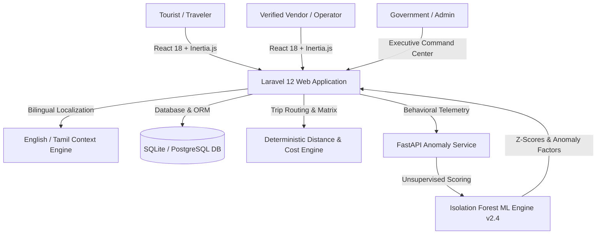

# 🌴 TN Explore — AI-Powered Smart Tourism & Anomaly Detection Platform

[](https://laravel.com)
[](https://reactjs.org)
[](https://inertiajs.com)
[](https://scikit-learn.org)
[](#)
[](LICENSE)

> **TN Explore** is an intelligent, full-stack tourism management and trip planning platform built for Tamil Nadu's 38 districts and inter-state corridors (Kerala, Karnataka, Puducherry, Andhra Pradesh). It combines algorithmic budget trip generation, real-time vendor operations, and an **Isolation Forest Unsupervised Machine Learning engine** for operator anomaly and fraud detection.

---

## 🏛️ System Architecture



---

## ✨ Key Feature Modules

### 1. ⚡ Smart Trip Planner (4-Tap Guided Generator)
- **Instant Plan Comparison**: Generates 3 parallel tiers (*Budget Explorer*, *Balanced Standard*, *Comfort & Premium*) instantly based on traveler count, duration, and budget.
- **Interest-Driven Route Ranking**: Automatically prioritizes places based on tags: *Temples & Spiritual*, *Hills & Mist*, *Beaches & Ocean*, *Wildlife & Safari*, *Heritage & UNESCO*, *Adventure & Treks*, *Food & Culinary*, and *Hidden Gems*.
- **Multi-Modal Transit Modes**: Supports *Public Transit (TNSTC/Trains)*, *Self-Drive Bike Rentals*, *AC Sedan*, *SUV*, and *Tempo Traveller*.
- **Day-by-Day Route & Stops**: Optimized driving times, visit hour time-slots, and interstate permit notices.
- **Trip Mates Collaboration**: Shareable links for friend groups to vote on candidate circuits and split shared expenses.

### 2. 🛡️ AI Trust & Fraud Defense (Isolation Forest Anomaly Engine)
- **3-Layer Hybrid Architecture**: Combines deterministic compliance rules with unsupervised Isolation Forest anomaly scoring (`v2.4-iso-forest`).
- **Peer-Group Behavioral Profiling**: Detects outliers across price deviations, sudden cancellation spikes, duplicate fleet registration, and off-hour booking spikes.
- **Targeted Multi-Vendor Scanning**: Admin drawer allows selecting individual or batch operators across districts for live risk re-scoring.
- **Administrative Triage Workflow**: Integrated action modals to *Dismiss with Audit Reason*, *Issue Official Warning*, *Request License Information*, or *Suspend Operator*.

### 3. 🏢 Admin Executive Command Center
- **Responsive KPI Oversight**: Real-time monitoring of custom itineraries, registered vendors, pending KYC verifications, travelers, confirmed bookings, and gross revenue.
- **KYC Verification Gate**: Secure inspection of government tourism licenses, vehicle RC books, and identity proofs.
- **Review & Media Moderation**: Moderation queues for traveler reviews and high-resolution place photography.

### 4. 🚐 Vendor Studio & Fleet Management
- **Fleet Inventory & Documents**: Dynamic vehicle onboarding, permit tracking, insurance verification, and blocked-out date management.
- **Two-Tier District Coverage**: Configurable primary and secondary operating districts.
- **Live Trip Opportunities**: Real-time notifications when travelers create custom trip itineraries in the operator's district.

### 5. 💬 Real-Time Trip Chat & Quotes
- **Direct Traveler-Vendor Threading**: In-app negotiation room with message threads, quote proposals, and status badges.

---

## 🛠️ Technology Stack

| Layer | Technologies Used |
|---|---|
| **Frontend** | React 18, Inertia.js v2, Tailwind CSS, Lucide Icons, Leaflet Maps, Recharts |
| **Backend Framework** | Laravel 12 (PHP 8.2+), Eloquent ORM, Ziggy Routing |
| **Machine Learning / AI** | FastAPI, Python 3.12, Scikit-Learn (Isolation Forest), Pandas, NumPy |
| **Database** | SQLite (Offline Lab Ready) / PostgreSQL |
| **Typography & Fonts** | Playfair Display, Inter, Noto Sans Tamil |
| **Localization** | Dynamic English & Tamil (`ta`) Language Context |

---

## 🚀 Quick Start & Installation Guide

### Prerequisites
- **PHP 8.2+** and **Composer**
- **Node.js 18+** and **npm**
- **Python 3.10+** (for ML Anomaly engine)

### 1. Clone the Repository
```bash
git clone https://github.com/Gowthami0704/travel-and-tourism.git
cd travel-and-tourism/tn-explore
```

### 2. Configure Backend Environment
```bash
cp .env.example .env
composer install
php artisan key:generate
php artisan migrate --seed
```

### 3. Install & Build Frontend
```bash
npm install
npm run build
```

### 4. Run Development Servers
```bash
# Terminal 1: Laravel Backend Server (Port 8000)
php artisan serve

# Terminal 2: Vite Dev Server (Port 5173)
npm run dev

# Terminal 3 (Optional): FastAPI ML Anomaly Engine (Port 8001)
cd ai-service
python evaluate_vendor_trust.py
```

Open your browser at **`http://localhost:8000`**.

---

## 📂 Repository Structure

```
travel-and-tourism/
├── tn-explore/
│   ├── app/
│   │   ├── Http/Controllers/    # Tourist, Vendor, and Admin Controllers
│   │   ├── Models/              # Eloquent Models (Places, CustomTrips, Vendors, Vehicles, etc.)
│   │   └── Services/            # TripPlannerService, VendorAnomalyScanner, MediaPipeline
│   ├── ai-service/              # Python FastAPI Isolation Forest anomaly scoring engine
│   ├── database/
│   │   ├── migrations/          # Complete database schema definitions
│   │   └── seeders/             # District, Place, Vendor, and Baseline seeders
│   ├── resources/
│   │   ├── js/
│   │   │   ├── Components/      # UI Design System (KpiCard, StatusChip, Button, etc.)
│   │   │   ├── Layouts/         # AuthenticatedLayout, VendorLayout, AdminLayout
│   │   │   └── Pages/           # Tourist, Vendor Studio, and Admin Command Center views
│   │   └── views/               # Blade root template
│   ├── routes/
│   │   ├── web.php              # Full application routes
│   │   └── auth.php             # Authentication & verification routes
│   ├── scripts/                 # System audit, benchmark, and validation scripts
│   └── package.json             # Frontend dependencies
└── README.md
```

---

## 🔒 Security & Privacy
- Zero hardcoded API keys or private credentials in version control.
- All secrets are loaded through environment variables (`.env`).
- Role-based authorization middleware separates Tourist, Vendor, and Super Admin privileges.

---

## 📄 License
This project is open-source and licensed under the [MIT License](LICENSE).
